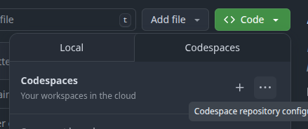
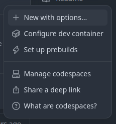
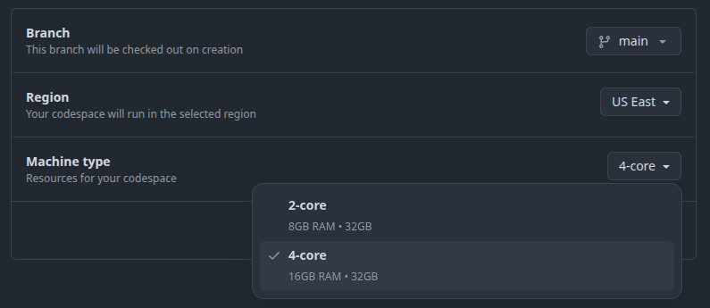
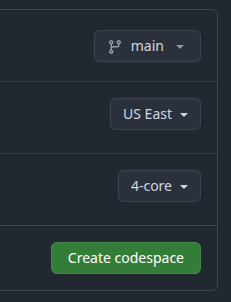
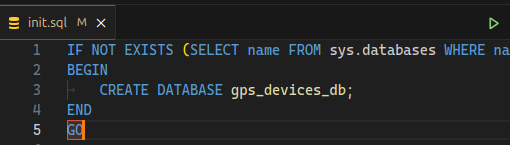
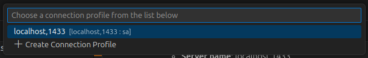

## Pasos para ejecutar el proyecto

1. Hacer clic en el botón "**Code**", luego en los tres puntos al lado del botón más "**+**", en el apartado de **Codespaces**.

    

2. Se abrirá un modal, dar clic en "**+ New with options...**".

    

3. Se abrirá una nueva página, en el apartado de **Machine type**, abrir el desplegable y seleccionar "**4-core**", la cual consta de 16GB RAM y es suficiente para la ejecución del proyecto.

    

4. Dar clic en "**Create codespace**" y esperar a que se cree el espacio de trabajo.

    

5. Ejecutar el siguiente comando en la terminal en la ruta de la raíz del proyecto, para iniciar la creación de los contenedores de Docker:

    ```bash
    cd /workspaces/PruebaReactPython && docker compose up --build
    ```

6. Mientras se crean los contenedores, ejecutar el siguiente comando en una nueva terminal en la ruta de la raíz del proyecto, para instalar **Microsoft ODBC 18**, el cual es necesario para la conexión a SQL Server:

    ```bash
    cd /workspaces/PruebaReactPython && source post-create.sh
    ```

7. Abrir la extensión de **SQL Server**, la cual se identifica con el siguiente ícono:

    

8. Ingresar los datos de conexión a la base de datos, y luego dar clic en "**Connect**":

    - **Server name**: localhost,1433
    - **Authentication type**: SQL Login
    - **User name**: sa
    - **Password**: SuperSecretPassword123!

    

9. Abrir el archivo **init.sql**, el cual se encuentra en la ruta **./database/init.sql** y ejecutar el script que se encuentra en él, dando clic en el botón de "**Run**" (el ícono de un triángulo verde) en la parte superior de la ventana del editor.

    

10. Se abrirá un modal, seleccionar la primer opción, la cual dice "**localhost,1433**", debe ejecutarse el script sin inconvenientes.

    

    En la extensión de SQL Server, se puede observar que se ha creado la base de datos, la tabla y el procedimiento almacenado.

    

---


