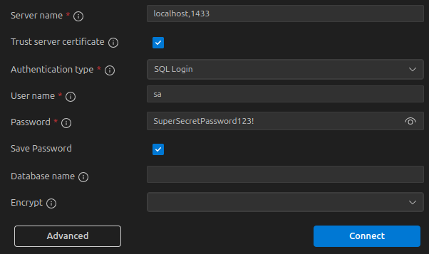

## Requisitos previos

- Tener instalado VS Code
- Tener vinculado VS Code con la cuenta de GitHub
- Tener instalada la extensión de GitHub Codespaces en VS Code

## Pasos para ejecutar el proyecto

1. Hacer fork del repositorio de GitHub.

    

    > ¡IMPORTANTE!
    >
    > Desde ahora vamos a realizar los siguientes pasos en el fork creado.

1. Hacer clic en el botón "**Code**", luego en el botón "**Create codespace on main**", en el apartado de **Codespaces**, y esperar a que se cree el espacio de trabajo.

    

1. Una vez terminado de crear el espacio de trabajo, cerramos la ventana del navegador y retornamos nuevamente a la URL del fork del repositorio, veremos que hay un espacio de trabajo creado, procedemos a dar click en el botón de los tres puntos **(...)**, que se encuentra al lado del status del espacio de trabajo, este abre un nuevo menú y en este menú damos click en la opción que dice **Open in Visual Studio Code**.

    

1. Ejecutar el siguiente comando en la terminal, para iniciar la creación de los contenedores de Docker, y esperar a que se creen los contenedores:

    ```bash
    cd /workspaces/PruebaReactPython && docker compose up --build
    ```

1. Una vez ya creados los contenedores, ejecutar el siguiente comando en una nueva terminal, lo cual instalará **Microsoft ODBC 18**, y creará la base de datos:

    ```bash
    cd /workspaces/PruebaReactPython && source post-create.sh
    ```

1. Abrir la extensión de **SQL Server**, la cual se identifica con el siguiente ícono:

    

1. Ingresar los datos de conexión a la base de datos, y luego dar clic en "**Connect**":

    - **Server name**: localhost,1433
    - **Authentication type**: SQL Login
    - **User name**: sa
    - **Password**: SuperSecretPassword123!

    

1. En la extensión de SQL Server, se puede observar que se ha creado la base de datos, la tabla y el procedimiento almacenado.

    

    > ¡NOTA!
    >
    > Se pueden realizar consultas a la base de datos desde el archivo **query.sql**, ubicado en la ruta **./database/query.sql**. Este archivo contiene ejemplos de consultas que se pueden realizar a la base de datos ordenando los dispositivos por precio y stock.
    >
    > Para ejecutar las consultas, dar clic en el botón de "**Run**" (el ícono de un triángulo verde) en la parte superior de la ventana del editor.

    

    

1. Una vez que se ha creado la base de datos, podemos dirigirnos al apartado de **ports** de VS Code.

    

    Si no hay puertos expuestos, hacer clic en el botón **Add Port**, y agregamos los puertos **8000** y **3000** para visualizar la aplicación en el navegador.

1. En el navegador de preferencia podemos dirigirnos a la documentación de la API en formato **Swagger**, la cual se encuentra en la siguiente URL:

    ```bash
    http://localhost:8000/docs
    ```

    

    Datos de ejemplo para la creación de un nuevo dispositivo:

    ```json
    {
      "Manufacturer": "Coban",
      "Model": "ASDFG3003",
      "ImageUrl": "https://www.vpcivil.co.in/wp-content/uploads/2016/12/garmin-gpsmap-64s-mapping-handheld-gps-5.jpg",
      "Stock": 3,
      "Price": 150,
      "Description": "EL mejor GPS que existe"
    }
    ```

    

    

1. Para visualizar la aplicación de React Router, podemos dirigirnos a la siguiente URL, en donde se pueden ver los dispositivos creados:

    ```bash
    http://localhost:3000
    ```

    

---

With love 🧡, David Almonacid.
